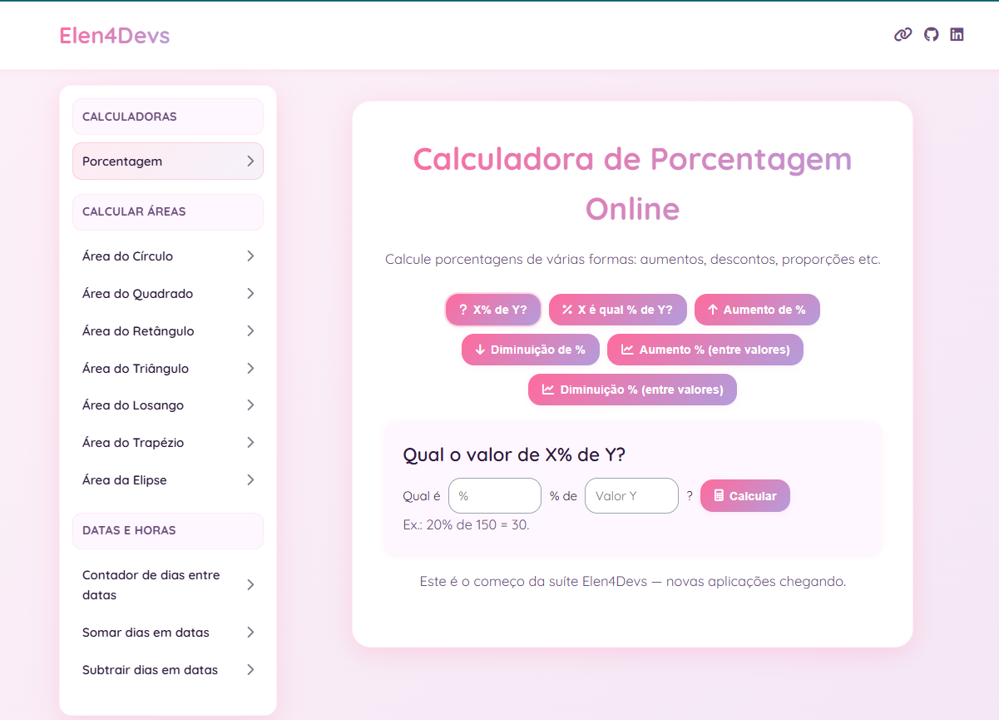

# Elen4Devs — Suíte de Calculadoras

Calculadoras gratuitas e acessíveis para o dia a dia: **porcentagens**, **geometria plana** (áreas) e **datas** (somar/subtrair dias).  
Feito em **HTML/CSS/JS puro**, sem dependências de build.

---
## 🔗 Acesso

- **Site (GitHub Pages):** https://elen-c-sales.github.io/elen4devs/

---

## ✨ Funcionalidades

- **Porcentagem** (6 modos)
  - X% de Y
  - X é que % de Y
  - Aumento/Diminuição por %
  - Aumento/Diminuição % entre valores
- **Geometria (áreas)**
  - Círculo (por **raio** ou **diâmetro**, com diagrama)
  - Quadrado, Retângulo, Triângulo
  - Trapézio, Paralelogramo, Losango
  - Elipse, Setor circular, Coroa circular (anel)
  - Polígono regular (n lados)
- **Datas**
  - Somar dias em uma data
  - Subtrair dias de uma data
- **UX/A11y**
  - Layout responsivo com menu lateral
  - Abas acessíveis (ARIA), navegação por teclado
  - Mensagens de erro claras e resultados com explicação
  - Formatação numérica **pt-BR** e unidades exibidas como `m²`, `cm²`, etc.

---

## 🧩 Como usar

1. Escolha a calculadora no **menu lateral**.
2. Preencha os campos.
3. Clique **Calcular** — o resultado aparece com uma explicação da fórmula utilizada.

---

## ♿ Acessibilidade

* Abas com `role="tablist"` / `role="tabpanel"` e `aria-selected`.
* Foco visível, navegação por **setas** entre abas.
* `aria-live` nos resultados para leitores de tela.
* Labels claros e mensagens de erro inline.

---

## 🛣️ Roadmap (ideias)

* Conversores (unidades, temperatura, moeda\* com taxa fixa manual)
* Datas: diferença entre datas (D−D), adicionar meses/anos
* **Tema claro/escuro** e persistência via `localStorage`
* **PWA** (instalável/offline)
* i18n (**en-US**) mantendo pt-BR como padrão
* SVGs/diagramas para todas as formas geométricas

> Sugestões são bem-vindas: **[e.camila.sales@gmail.com](mailto:e.camila.sales@gmail.com)**

---

## 👩‍💻 Desenvolvimento

Código organizado em **componentes visuais simples** (cards) e funções JS pequenas:

* Reuso de utilitários (`formatNumber`, validação, etc.).
* Sem frameworks — fácil de manter e hospedar (GitHub Pages, Netlify…).

---

## 🤝 Contribuindo

1. Faça um **fork**
2. Crie uma branch: `git checkout -b feature/minha-melhoria`
3. Commit: `git commit -m "feat: descreva sua mudança"`
4. Push: `git push origin feature/minha-melhoria`
5. Abra um **Pull Request**

---

## 📄 Licença

**MIT** — fique à vontade para usar e adaptar.

---

## 👤 Autoria & Contato

Feito por **Elen Camila Sales**
Portfólio: [https://elen-c-sales.github.io/](https://elen-c-sales.github.io/)
GitHub: [https://github.com/elen-c-sales](https://github.com/elen-c-sales)
LinkedIn: [https://www.linkedin.com/in/elen-camila-sales/](https://www.linkedin.com/in/elen-camila-sales/)
Contato: **[e.camila.sales@gmail.com](mailto:e.camila.sales@gmail.com)**

